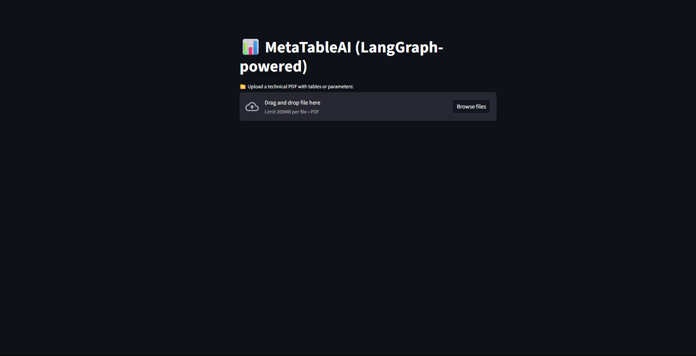
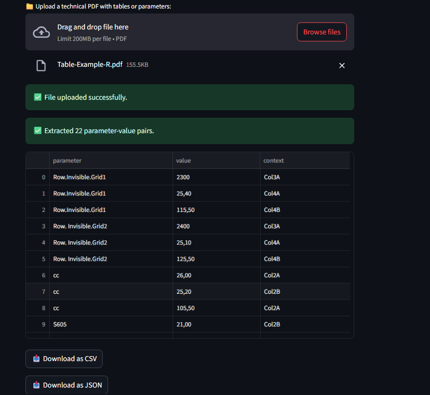

#  MetaTableAI – LLM-Powered Table Parameter Extractor

MetaTableAI is a smart document parser that uses large language models (LLMs) to extract structured parameter–value–context triples from unstructured tables in PDF files. It’s perfect for processing complex engineering datasheets, technical specs, and scanned tabular content.

---

##  Features

- Extracts clean JSON from complex tables in PDFs
- Captures `parameter`, `value`, and `context` for each row
- Uses [OpenRouter](https://openrouter.ai) with `deepseek-chat-v3`
- Plug-and-play with Streamlit, LangGraph, or FastAPI
- Outputs clean `extracted_data.json`

## Tech Stack

| Layer      | Technology / Tool         |
|------------|----------------------------|
| LLM Engine | DeepSeek Chat v3
| LLM Router | OpenRouter API 
| PDF Parser | PyMuPDF
| Secrets    | python-dotenv 
| Frontend   | Streamlit 

## Instructions

### 1.Set your OpenRouter key in `.env`
OPENROUTER_API_KEY=your_openrouter_api_key_here

### 2.Install dependencies
pip install -r requirements.txt

### 3.Run Streamlit application
Streamlit run app.py

### 4. Upload the pdf with data
Upload in frontend or manually use pdf 

### 5. Download Json containing the extracted data
Download the pdf from frontend . 

### Screenshots
## Interface :

## Sample output:

## License
MIT License – Free for personal and commercial use.

## Author 
Abhishek SS

